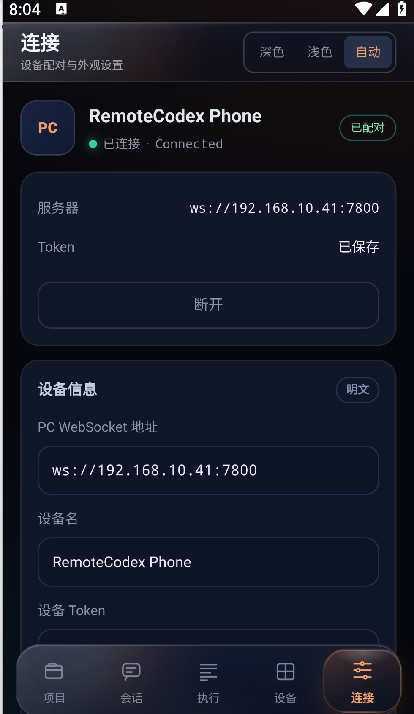
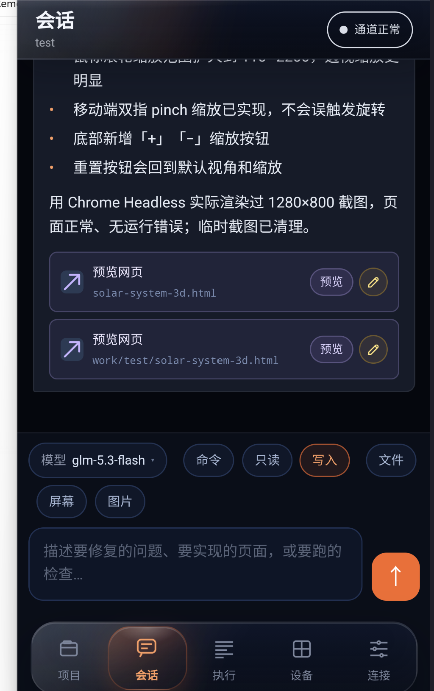

# RemoteCodex Agent

[English](README.en.md) | [中文](README.md)  
Repository: [qmdq/remote-codex-backend](https://github.com/qmdq/remote-codex-backend)  
Companion mobile app: [qmdq/remote-codex-app](https://github.com/qmdq/remote-codex-app)

The PC-side Python Agent is the remote execution and security hub for the mobile Codex Agent tool. The mobile app provides the Codex Agent experience on phones; Codex calls, command execution, file modifications, system metrics, terminal access, and screen control are performed by this Agent on the PC. It also manages device pairing, authorized projects, event streams, approvals, and access boundaries.

By default, the Agent listens on `127.0.0.1`. LAN access requires an explicit configuration that opens the listening address.

## Capabilities

- **Devices and access:** generate pairing codes; approve, reject, or revoke devices. Only SHA-256 hashes of device tokens are stored.
- **Projects and sessions:** create or import projects, discover local Codex projects, resume threads, sync PC Codex chat history, and replay multi-session events.
- **Temporary chats:** ask read-only questions without selecting a directory; request directory access from the phone and approve a manually selected folder in the PC console.
- **Codex execution:** forward tasks to the local Codex SDK with model selection, sandbox modes, interruption, and realtime event forwarding.
- **File access:** browse, read, and save files inside authorized roots, with helper support for image and HTML previews.
- **Operations control:** CPU, memory, disk, and network metrics; PTY terminal; screen-frame subscription; basic mouse and keyboard input.

## Preview

<div align="center">
  
  
  <br>
  
  
</div>

## Quick Start

From the backend repository root:

```powershell
python -m venv .venv
.\.venv\Scripts\python.exe -m pip install -e ".[monitor,desktop,terminal]"
Copy-Item config.local.example.json config.local.json
.\.venv\Scripts\python.exe -m app serve --config config.local.json
```

`start.bat` starts the Agent in the background, installs missing dependencies on first run, and opens the admin console. Use `stop.bat` to stop it.

Edit `projects.allowed_roots` in `config.local.json` before allowing LAN clients. The local configuration listens on `0.0.0.0:7800`; the database is stored under `runtime/`. On the phone, enter `ws://<PC-LAN-IP>:7800`. Run `ipconfig` to find the PC IPv4 address.

The console URL is printed as `admin console: http://127.0.0.1:7801/admin?token=...` and written to `%TEMP%\RemoteCodex\admin-console.txt`. Open it in a PC browser to generate pairing codes, approve or reject phones, revoke devices, and inspect backend settings.

With the default configuration, the current working directory is the only allowed root and the database is stored under `%LOCALAPPDATA%\RemoteCodex`. You can select another JSON configuration with `--config`.

## Device Pairing

Open the admin console in a PC browser and choose **Generate pairing code**. In the mobile app, open **Devices**, choose **Start pairing**, enter the Agent address and the six-digit code, then approve the request in the console. The app saves its device token and connects automatically.

After a WebSocket connection is established, the authentication frame is:

```json
{
  "v": 1,
  "type": "hello",
  "id": "1",
  "payload": {
    "device_token": "YOUR_DEVICE_TOKEN"
  }
}
```

Before pairing, the first frame uses `pair.request` with a payload such as `{"code":"123456","device_name":"iPhone"}`.

## Protocol

All messages use the JSON envelope:

```json
{
  "v": 1,
  "id": "req-1",
  "type": "project.create",
  "payload": {
    "name": "remoteAi",
    "path": "D:\\work\\code\\remoteAi"
  }
}
```

Supported requests include:

- `project.list` / `project.create` / `project.select`
- `project.temporary.create` / `project.authorization.request` / `project.authorization.status`
- `codex.project.list` / `codex.project.import`
- `project.model`
- `codex.history`
- `file.list` / `file.read`
- `turn.start` / `turn.interrupt` / `thread.resume`
- `event.replay`
- `metrics.subscribe` / `metrics.unsubscribe`
- `screen.subscribe` / `screen.unsubscribe` / `screen.input`
- `terminal.start` / `terminal.input` / `terminal.resize` / `terminal.close`
- `ping`

Server messages include `ready`, `ok`, `error`, `project.snapshot`, `codex.history.snapshot`, `file.list.snapshot`, `file.read.snapshot`, `codex.event`, `agent.event`, `event.synced`, `metrics`, `screen.frame`, `terminal.ready`, `terminal.output`, and `terminal.exit`.

A temporary chat uses a private PC scratch directory as its Codex working directory and is forced to `read_only`. Until authorization, file browsing/reading/writing, uploads, diffs, reverts, terminal access, and `workspace_write` turns are rejected. After the phone requests directory access, the PC console must manually select and approve a directory inside an allowed root. Approval binds that directory to the chat and converts it into a regular project.

Terminal sessions are bound to the current WebSocket connection and can only start inside an imported project working directory. With optional Windows dependency `pywinpty`, the backend uses a full PTY; otherwise it falls back to pipe mode, and `ready.capabilities.terminal_pty` returns `false`.

Codex SDK events are forwarded unchanged through the `codex.event.event` field.

Touch-based remote control requires the desktop-control extras:

```powershell
.\.venv\Scripts\python.exe -m pip install -e ".[monitor,desktop,terminal]"
```

## Security Model

- The default configuration binds only to loopback; public exposure requires an explicit tunnel or proxy deployment.
- Device tokens are random; the database stores only SHA-256 hashes.
- Pairing codes are short-lived, rate-limited, and approved locally on the PC.
- Projects cannot be created outside allowed roots.
- Temporary chats never expose their scratch directory; directory capabilities require explicit PC approval.
- Turns use the Codex `workspace-write` sandbox by default and can degrade to `read-only` when required by configuration or platform capability.
- Disconnecting does not stop a running turn; reconnect and replay events by `seq`.

## Development

```powershell
python -m unittest discover -s tests -v
python -m app doctor
```

The Agent uses the real `openai-codex` SDK by default. Set `"codex": {"mode": "fake"}` to use the built-in `FakeCodexGateway` for protocol and integration tests without model calls. The real SDK adapter imports `codex` lazily and reports import errors at startup.

## License

GPL-3.0-or-later. Closed-source commercial integration or redistribution requires separate commercial authorization from the author.
